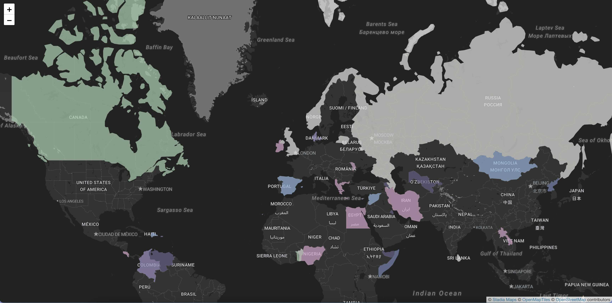

# visited-countries-map

This is a static website template for creating a map showing countries a user has visited. It includes:

- A GeoJSON file with country boundaries,
- JavaScript code for map generation,
- A CSV file listing visited countries.

To add or remove countries visited, modify the CSV file `countries-visited.csv`.

## Example Map

